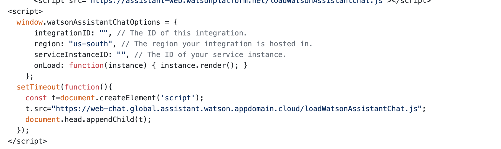

# Insurance Policy Assistant

This Code Pattern will demonstrate a methodology to build an assistant which can answer queries regarding the insurance policies of various companies. And it will also compare the policies and top-up related queries given by them. With the help of Watson Discovery, we will develop a model that will understand the policies and provide an interactive interface to the user. This application will come in handy for various insurance brokers and also a layman who wants to know and compare the policies of various companies.

When user has completed the pattern he will-

* Know how to connect a UI to Watson Assistant using Webhooks
* Send sample documents to Watson Discovery ans train custom model 
* User will learn how to integrate insights generated with Discovery back to Assistant


## Pre Requisite

* [IBM Cloud Account](http://cloud.ibm.com/)

## Steps

* Set up discovery Service
* Create a new Collection 
* Upload the Documents
* Configure the documents - Smart Documents Understanding
* Create Watson Assistant service
* Create Search Plus and connect to the Discovery service 
* Query Results 
* Copy integration ID and update to Flask 
* Run the flask App

### Copy integration ID and update to Flask 

* In the repo `template/UI.html`, under line 418, update the copied integration ID within the script tag



### Run the Flask App

* Navigate to cloned repo folder

```
pip install -r requirements.txt
```

* Then run 

``` python app.py
```

## Sample Output

* The UI will show you the various Insurance Policies that are offered

  

* In the bottom right, you will have the integrated chatbot interface from Watson Assistant + Discovery

  
  
